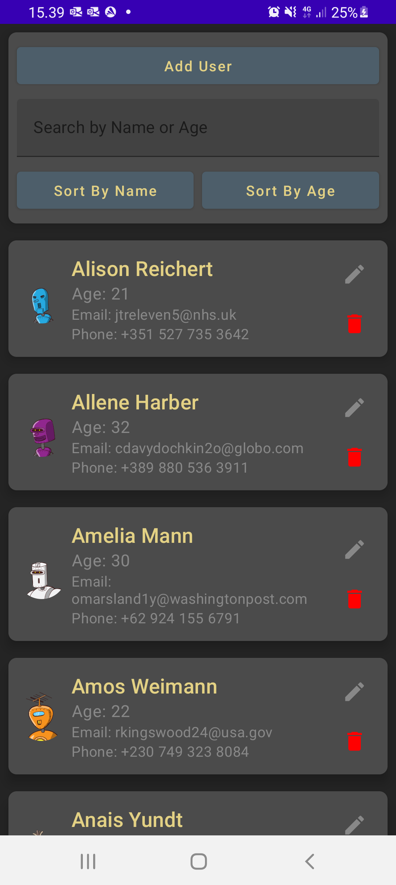
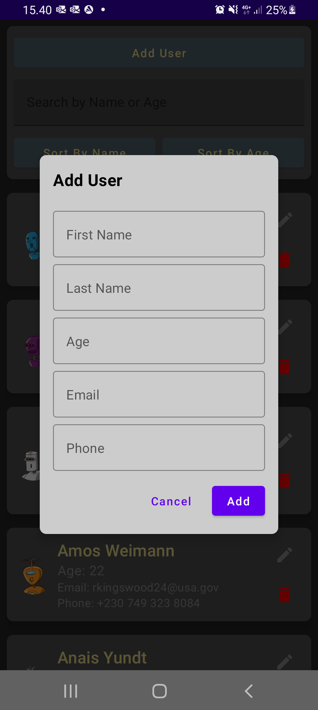
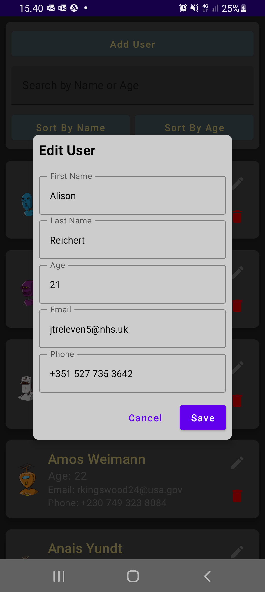

# Final Android Project

This is an Android project that demonstrates a user management application. It allows you to add, edit, sort and delete users using user interface built with Jetpack Compose.

## Features

- Add new user by providing their details such as name, age, email, and phone number.
- Edit an existing user's details.
- Delete a user from the user list.
- Search users by name or age.
- Sort users by name or age.

## Screenshots

  
  
  

## Libraries and Technologies Used

- [Android Jetpack Compose](https://developer.android.com/jetpack/compose) - Modern UI toolkit for building native Android apps.
- [OkHttp](https://square.github.io/okhttp/) - HTTP client for making network requests.
- [Coil](https://coil-kt.github.io/coil/) - Image loading library for Android.
- [Gson](https://github.com/google/gson) - JSON serialization/deserialization library.

## Installation

1. Clone the repository to your local machine.
2. Open the project in Android Studio.
3. Build and run the application on an Android device or emulator.

## Usage

- Launch the application and view the list of users.
- Use the "Add User" button to open add a new user dialog.
- Tap on a "Edit Pencil Icon" to edit their details.
- Tap on a red "Trash Can" to delete that user.
- Search for users by name or age using the search bar.
- Sort the users by name or age using the provided buttons.

